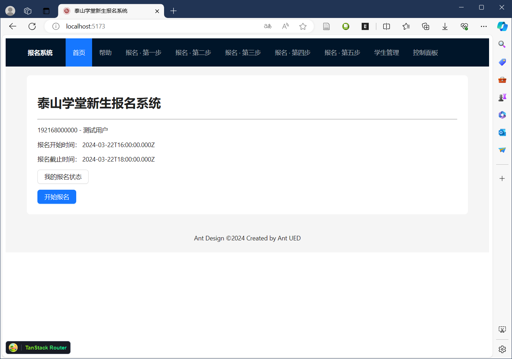
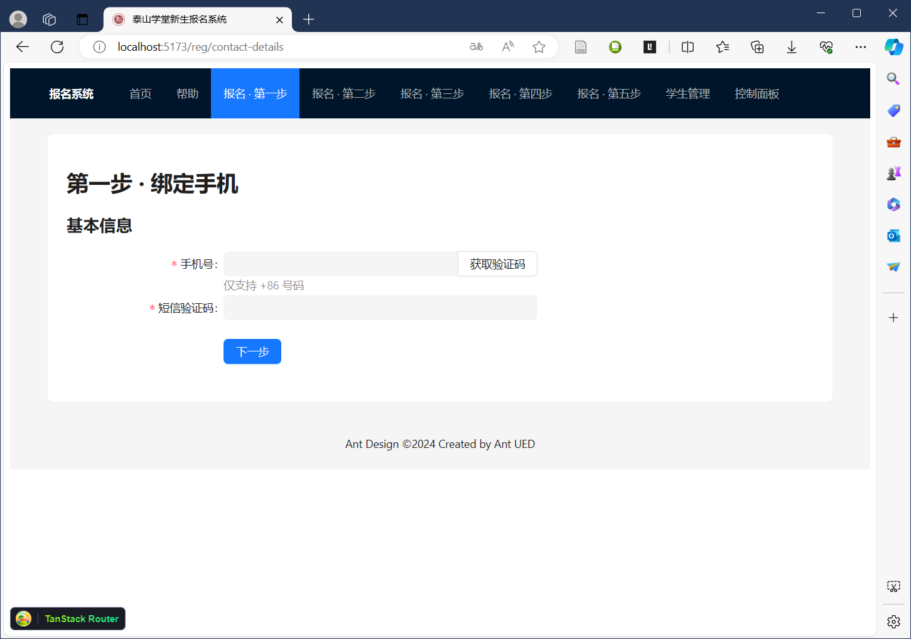
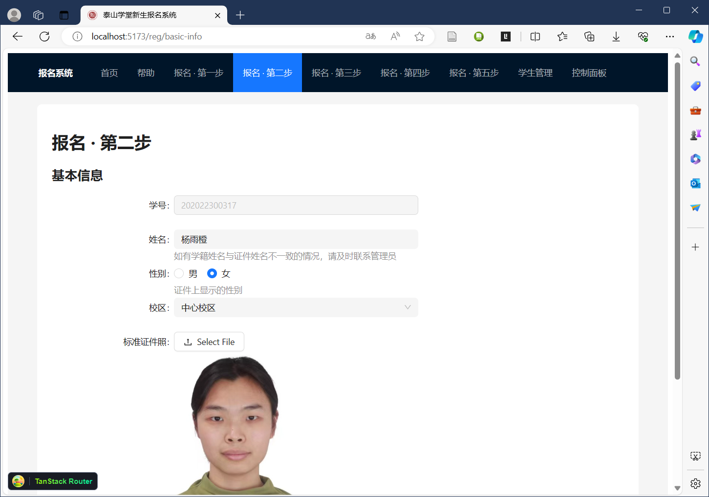
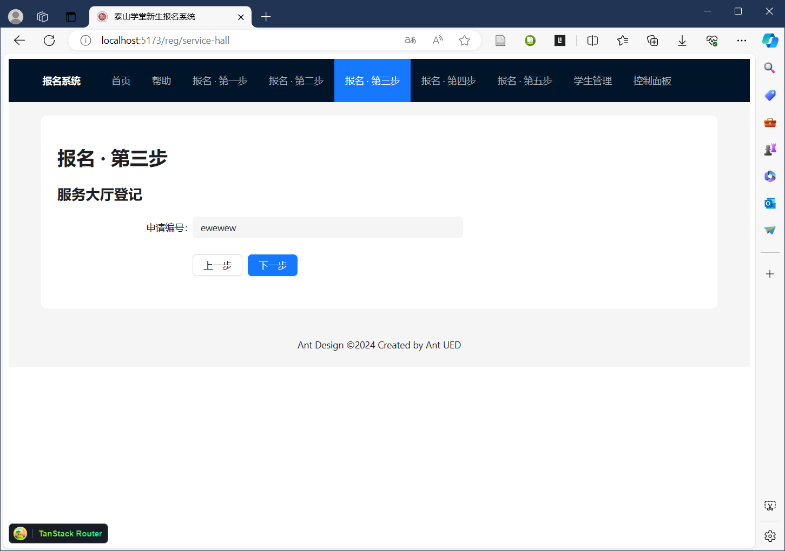
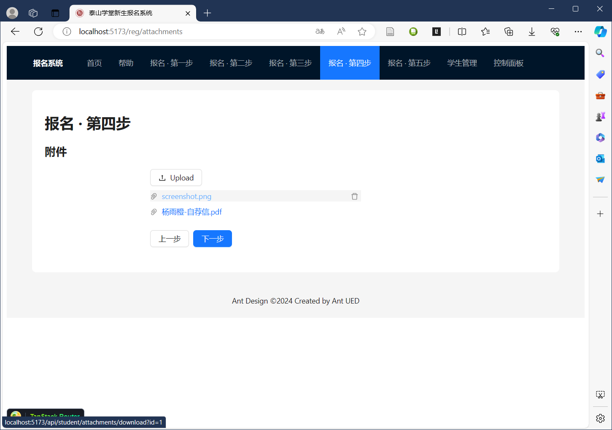
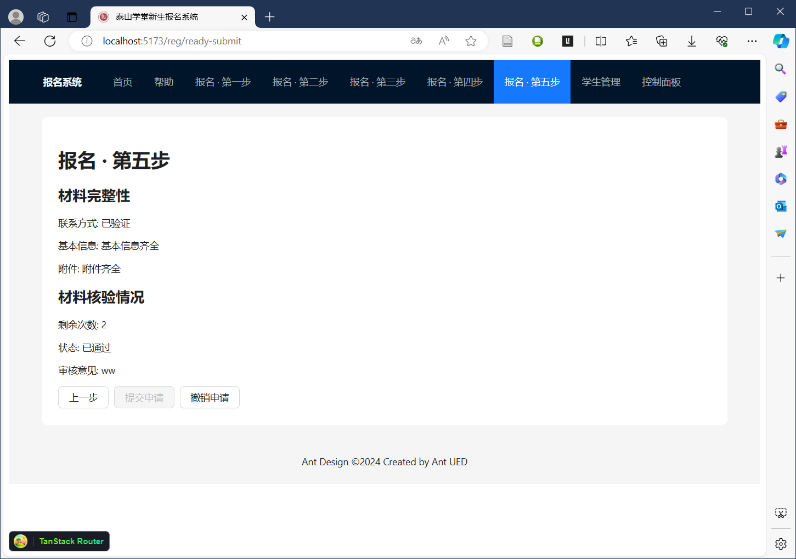
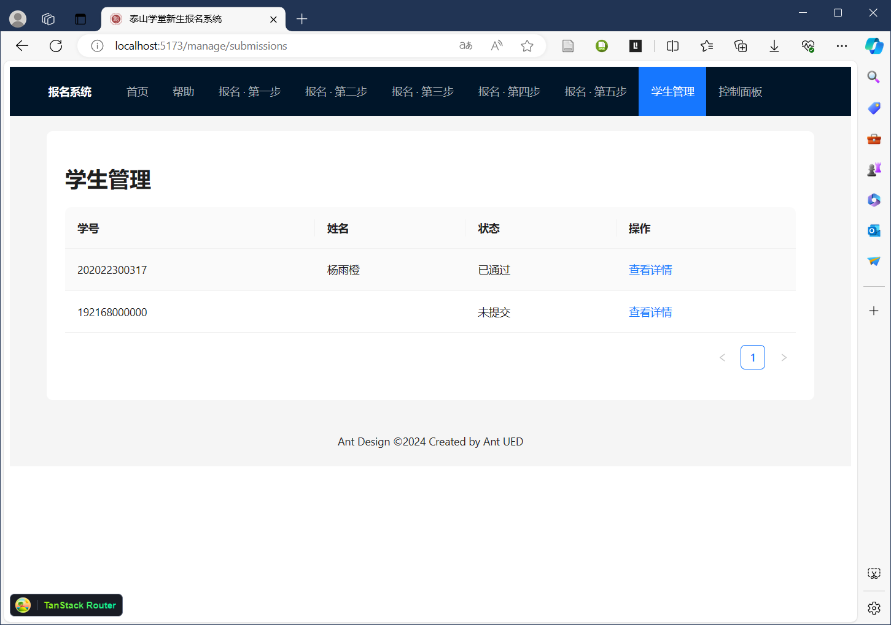
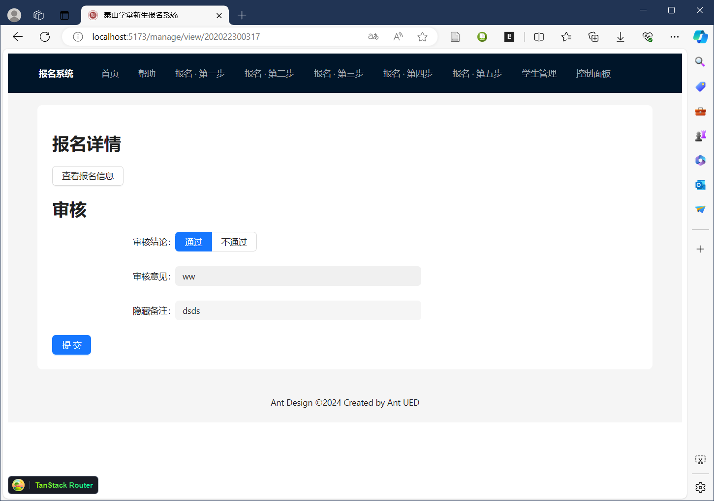
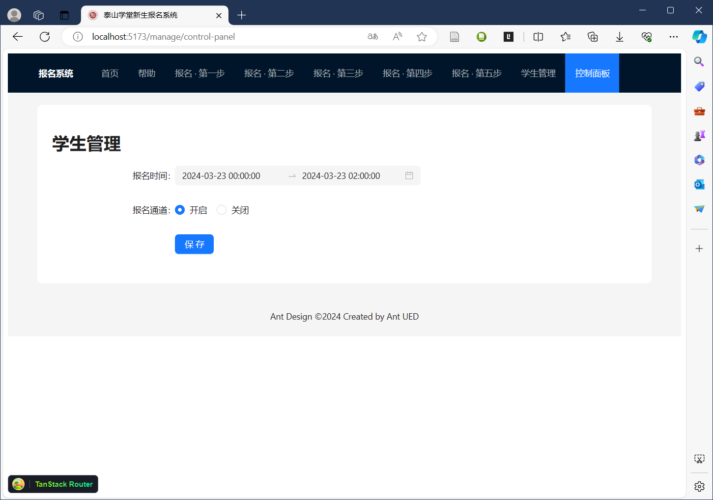

# New framework for TSXT freshmen system

## Technology Stacks:

frontend: react, vite, ant design, tanstack route

backend: django, sqlite, django-cas

## features

* applicaton form temporary storage
* photo preview
* manual check
* control panel & global config 

In progress:

* SMS OTP verification
* better human-computer interface
* interview component

## screenshots

